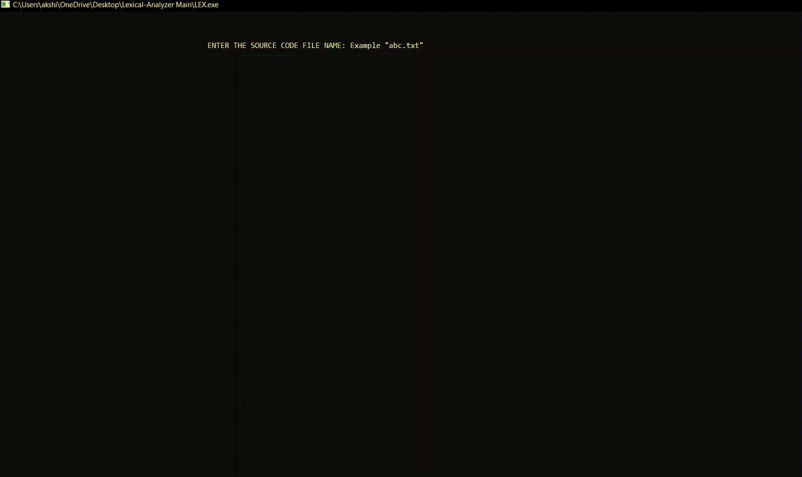

<h1 align ="center"> Lexical Analyzer for C++ written in C++.</h1>

<h2> Table of Contents: </h2>

- [About this project](#about-this-project)
- [Tokens](#tokens)
- [How Lexical Analyzer functions](#how-lexical-analyzer-functions)
- [How to Run this Project](#how-to-run-this-project)
- [Assumptions for Subset of C++](#assumptions)
- [Sample Source Code](#sample-source-code)
- [Screen Shots](#screen-shots)


## About this project:
This project is a lexical analyzer generator written in C++. Lexical Analysis is the first phase of the compiler also known as a `scanner`. It converts the High level input program into a sequence of Tokens.



## Tokens:
A lexical token is a sequence of characters that can be treated as a unit in the grammar of the programming languages.

Example of tokens:

* **Type token** (id, number, real, . . . )
* **Punctuation tokens** (IF, void, return, . . . )
* **Alphabetic tokens** (keywords)

## How Lexical Analyzer functions

1. Tokenization i.e. Dividing the program into valid tokens.
2. Remove white space characters.
3. Remove comments.
   

   
> ### Note: This is a Lexical Analyzer for a particular `subset of C++ language` explained under [Assumptions:](#assumptions) . It may not be able to parse the all token of C++ language.

## ASSUMPTIONS:

#### While designing the LexicalAnalyzer, I have assumed the following assumptions for my Language:

- [x] **Special Symbol**: `;` `{` `}` `(` `)` `,` `#`
- [x] **Keyword**: `int`, `char`, `float`, `bool`, `cin`, `cout`, `main`
- [x] **Pre-processor Directives**: `include`, `define`
- [x] **Library**: `iostream`, `studio`, `string`
- [x] **Operators**: `*`, `+`, `>>`, `<<`,`>`,`<`
- [x] **Numbers/Integers**:  `0 to 9`.
- [x] **Identifies/ Variables**: `All alphabetic strings except the keywords, numbers, Pre-processor directive and library strings`.

### Sample Source Code:
> MySourceCode.txt
```
#include <iostream>
#define LIMIT 5
using namespace std ;
int main(){
    // this comment is written by akshit mangotra for lexical analyzer to avoid reading the comments
    int A , B ;
    cin >> A >> B;
    cout << A * B ; 
}
```

### Screen Shots:

#### MySourceCode.txt

<br><br>

#### Output(Console)

<br><br>

#### OutputFile.txt


    
